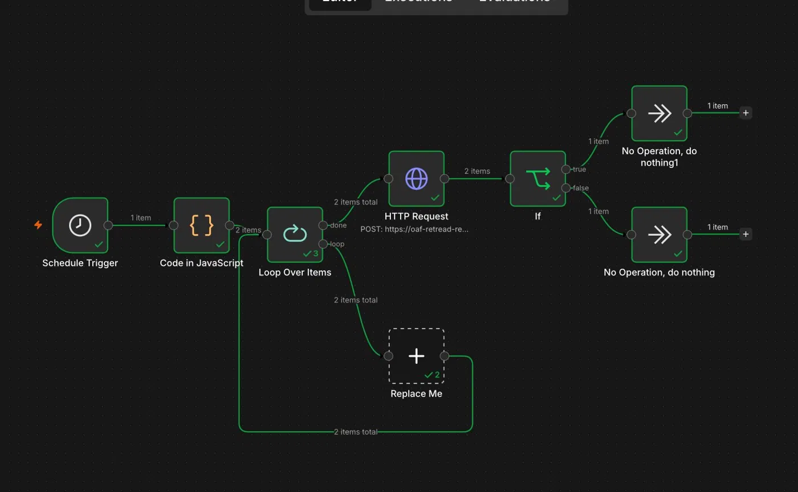

# 🤖 AI Job Agent

An autonomous AI agent that scores job descriptions for relevance,
retrieves matching resume sections using RAG, and generates tailored
cover letters — fully automated via n8n.

**Built with:** Python · FastAPI · ChromaDB · Groq (Llama 3.3) · 
sentence-transformers · SQLite · n8n

**Cost to run:** $0

---

## What It Does

Instead of manually reading every job posting and writing cover letters
from scratch, this agent does it automatically:

1. Takes a job description as input
2. Scores it 0-100 against your profile using an LLM
3. Retrieves the most relevant resume sections using semantic search
4. Generates a tailored cover letter using only your real experience
5. Saves everything to a database for review
6. Runs automatically every morning via n8n

---

## System Architecture

n8n Scheduler (9AM daily)
│
▼
Job List (Code Node)
│
▼
Loop Over Jobs
│
▼
FastAPI /process endpoint
│
├── LLM Scorer (Groq + Llama 3.3)
│       └── Returns score 0-100 + verdict
│
├── RAG Retriever (ChromaDB + sentence-transformers)
│       └── Returns top 3 relevant resume sections
│
└── Cover Letter Generator (Groq + Llama 3.3)
└── Writes grounded, tailored letter
│
▼
SQLite Database (stores all results)
│
▼
IF score >= 60 → notify

---

## Tech Stack

| Component | Technology | Purpose |
|---|---|---|
| PDF Parser | PyMuPDF | Extract resume text |
| Chunker | Python | Split resume by section |
| Embeddings | sentence-transformers | Convert text to vectors |
| Vector DB | ChromaDB | Semantic search |
| LLM | Groq API (Llama 3.3 70B) | Scoring + generation |
| API | FastAPI | HTTP endpoints |
| Database | SQLite | Store applications |
| Orchestration | n8n | Automate pipeline |
| Security | API key auth | Protect endpoints |

---

## API Endpoints

| Method | Endpoint | Description |
|---|---|---|
| GET | / | Health check |
| POST | /score | Score a job description |
| POST | /cover-letter | Generate cover letter |
| POST | /process | Full pipeline (score + letter + save) |
| GET | /applications | View all saved applications |

All endpoints except `/` require `X-API-Key` header.

---

## How RAG Works Here

Traditional keyword matching asks:
> "Does this job contain the word Python?"

This system asks:
> "Which parts of my resume are most *meaningful* for this job?"

The resume is split into sections, converted to vector embeddings,
and stored in ChromaDB. When a job comes in, its embedding is
compared against all resume sections. The closest matches are
retrieved and passed to the LLM as context for cover letter generation.

This prevents the LLM from hallucinating qualifications —
it can only write about experience that actually exists in the resume.

---

## n8n Workflow



---

## Project Structure

ai-job-agent/
│
├── resume_engine/          # RAG pipeline
│   ├── extract.py          # PDF → text
│   ├── chunk.py            # text → sections
│   ├── embed.py            # sections → vectors → ChromaDB
│   └── retrieve.py         # query → relevant chunks
│
├── writer/                 # LLM pipeline
│   ├── groq_client.py      # Groq API wrapper
│   ├── scorer.py           # job relevance scoring
│   └── cover_letter.py     # cover letter generation
│
├── api/                    # FastAPI backend
│   ├── main.py             # endpoints + auth
│   └── database.py         # SQLite operations
│
├── run.py                  # single entry point
└── requirements.txt

---

## Setup

### 1. Clone and install

```bash
git clone https://github.com/Haru-bit-code/ai-job-agent.git
cd ai-job-agent
python -m venv venv
source venv/bin/activate
pip install -r requirements.txt
```

### 2. Environment variables

Create a `.env` file:

GROQ_API_KEY=your_groq_api_key
AGENT_API_KEY=your_secret_api_key

Get a free Groq key at: console.groq.com

### 3. Add your resume

Place your resume PDF at:
data/resume.pdf

### 4. Build the vector database

```bash
python resume_engine/embed.py
```

### 5. Start the API

```bash
uvicorn api.main:app --reload --port 8000
```

### 6. Test it

```bash
curl -X POST http://localhost:8000/process \
  -H "Content-Type: application/json" \
  -H "X-API-Key: your_key" \
  -d '{
    "job_title": "Data Analyst",
    "company": "Example Corp",
    "job_description": "Python, SQL, data analysis, entry level",
    "auto_save": true
  }'
```

---

## Key Design Decisions

**Why RAG instead of sending the full resume?**
RAG retrieves only the 3 most relevant sections per job.
This reduces token usage and focuses the LLM on what matters
for that specific role.

**Why Groq instead of OpenAI?**
Groq's free tier runs Llama 3.3 70B at 300+ tokens/second.
No cost, faster than GPT-4, comparable quality for structured tasks.

**Why structured JSON output from the scorer?**
Plain text responses can't be filtered or sorted programmatically.
JSON output lets n8n route jobs by score, store results in SQLite,
and trigger notifications — all without parsing text.

**Why API key authentication?**
The API is exposed publicly via ngrok. Without authentication,
anyone with the URL could call endpoints, burn through the Groq
free tier, and access saved application data.

---

## Author

**Ansar Kamal**
Data Science Student | Kerala, India
[GitHub](https://github.com/Haru-bit-code) · 
[LinkedIn](https://linkedin.com/in/ansarkamal)